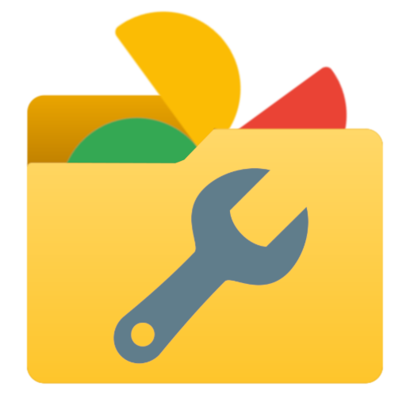
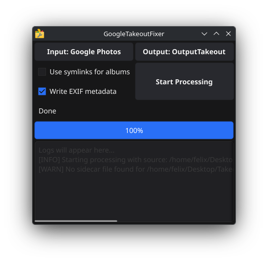

# GoogleTakeoutFixer

    

A tool that allows you to easily merge Google's weird JSON metadata with your images.

## The Issue
When you download your images from Google's "Google Photos" service through "Google Takeout", the metadata (location, time of creation, etc) is **often saved separately in JSON files instead of being embedded directly into your photos and videos.**
This can lead to problems:
- Files cannot be reliably sorted chronologically or by location
- A cluttered export with a messy file structure and many unnecessary files

## Solution
GoogleTakeoutFixer solves these issues by:
- **Writing EXIF metadata** directly into your media.
- **Organizing your files** into a clear and structured folder structure for easier navigation.
- **Automatically removing unnecessary JSON files**.

## Preview

    

## Tutorial
1. Download and install the latest release of GoogleTakeoutFixer from the [releases page](https://github.com/feloex/GoogleTakeoutFixer/releases). Pick the version that matches your operating system (E.g. Windows, macOS, Linux).
2. Extract the downloaded archive and run the executable file.
3. In the program, click on the "Select Google Takeout folder" button and choose the folder where you extracted your Google Takeout photos. Named something like "Google Photos"
4. Click on the "Select output folder" button and choose a folder where you want the fixed photos to be saved.
5. Check the checkboxes that you want to apply.
    - **"Write EXIF metadata"** will write the metadata from the JSON files into the photos and videos.
    - **"Use symlinks for albums"** will create file links pointing to image but in the year folder instead of copying the file into the album folder. This saves a lot of disk space if you have many albums.
6. Click the "Start processing" button and wait for the process to finish. The time it takes will depend on the amount of files in your takeout.

Once the process is complete, you can find your fixed photos in the output folder you selected.

## Planned Features
- Support for more languages
- Cancel button during processing in the GUI

## Credits
This project modifies metadata using the [ExifTool](https://exiftool.org/) library by **Phil Harvey**. ExifTool is licensed under the Perl Artistic license, or the GNU General Public License (see [here](https://exiftool.org/#license) for more details).

## Disclaimer
This project is an **independent open-source project** and is **not affiliated with, endorsed, or sponsored by Google LLC or any of its subsidiaries**. The use of the name "Google" in this repository is solely for descriptive purposes.